<p align="center">
  
</p>

<h1 align="center">CarePath AI</h1>

<h3 align="center">Autonomous Healthcare Navigation System</h3>

<p align="center"><em>Right Guidance. Right Specialist. Right Time.</em></p>

<hr>

<p align="center">
  
  
  
  
  
  
</p>

<p align="center">
  <a href="#overview">Overview</a> ·
  <a href="#key-features">Key Features</a> ·
  <a href="#technology-stack">Tech Stack</a> ·
  <a href="#architecture">Architecture</a> ·
  <a href="#core-modules">Core Module</a> ·
  <a href="#key-project-metrics">Key Project Metrics</a> ·
  <a href="#getting-started">Getting Started</a> ·
  <a href="#live-demo">Live Demo</a>
</p>

---

<a id="overview"></a>
## 📖 Overview

CarePath AI is an intelligent healthcare navigation platform designed to reduce diagnostic delays and help patients reach the most appropriate specialist faster. Instead of replacing doctors, CarePath AI acts as a healthcare navigation companion that analyzes symptoms, medical records, diagnostic reports, and treatment history to guide patients through their healthcare journey.

The platform combines Computer Vision, Natural Language Processing, Machine Learning, Retrieval-Augmented Generation (RAG), and a Multi-Agent Architecture to provide explainable, patient-centered healthcare recommendations.

---

## 🚀 Project Objectives

CarePath AI is designed to:

- Reduce diagnostic delays in healthcare.
- Guide patients toward the most appropriate specialist.
- Analyze symptoms, prescriptions, reports, and medical records.
- Detect patterns of ineffective treatments and referral needs.
- Provide explainable AI-generated healthcare insights.
- Help patients prepare for consultations.
- Support continuous care through monitoring and follow-ups.
- Improve healthcare accessibility through intelligent navigation.

---

## ❗ Problem Statement

Many patients spend months—or even years—searching for the correct diagnosis.

Common challenges include:

- Visiting multiple doctors before reaching the correct specialist.
- Undergoing repeated or unnecessary diagnostic tests.
- Difficulty understanding prescriptions and medical reports.
- Lack of visibility into their healthcare journey.
- Delayed referrals and fragmented care pathways.
- Poor follow-up and treatment adherence.

CarePath AI addresses these challenges by creating a structured, explainable, and intelligent healthcare navigation experience.

---

## 💡 Why CarePath AI Exists

Healthcare information is often scattered across reports, prescriptions, imaging scans, consultation notes, and laboratory results.

Patients frequently struggle to:

- Understand their medical information.
- Track treatment progress.
- Know when a treatment plan is not working.
- Determine which specialist they should consult next.

CarePath AI brings all healthcare information together and transforms it into actionable guidance through AI-driven clinical reasoning and healthcare navigation.

---


<a id="key-features"></a>

# ✨ Key Features

| Capability | What it enables |
| :--- | :--- |
| 🧠 **AI-Powered Patient Intake** | Structures symptoms, patient context, history, and encounter information for downstream AI workflows. |
| 📄 **Smart Document Analyzer** | Extracts structured information from uploaded medical reports, prescriptions, and supported documents. |
| 💊 **Medication Companion** | Analyzes prescription information, supports medication confirmation, and enables reminders and adherence workflows. |
| 📚 **Evidence-Backed Guidance (RAG)** | Retrieves relevant medical evidence and supporting sources to make AI guidance more transparent and explainable. |
| 🩺 **Explainable Referral Card** | Summarizes symptoms, medical history, reasoning, and evidence to explain why a specialist is recommended. |
| 👨‍⚕️ **CarePath Doctor Bridge** | Prepares a doctor-ready medical summary, generates case-specific questions, and enables expert review of AI outputs. |
| 🧠 **CarePath Memory** | Retains relevant patient context across interactions to provide consistent, context-aware guidance. |
| 🕐 **AI-Generated Patient Timeline** | Organizes symptoms, consultations, reports, prescriptions, referrals, treatments, and follow-ups into a chronological journey. |
| 📝 **Personalized Care Plan** | Converts relevant patient context and clinician input into structured next steps, monitoring, and follow-up guidance. |
| 🔔 **Follow-up Intelligence** | Supports post-consultation check-ins, reminders, treatment-response tracking, and escalation workflows. |
| 🛡️ **Safety-First Agent** | Detects configured safety signals and can interrupt the normal workflow when priority handling is required. |
| 🤖 **Multi-Agent Orchestration** | Uses LangGraph to coordinate specialized healthcare agents through shared state and conditional routing. |
| 🤝 **Human-in-the-Loop Review** | Allows AI workflows to pause for clinician review and resume with expert feedback incorporated into the patient context. |
| 📡 **SSE Workflow Streaming** | Streams agent execution, evidence retrieval, review requests, completion, and failure events to the frontend. |
| 🔗 **Structured AI Service Contracts** | Decouples the backend and LangGraph orchestration layer from individual AI providers and model implementations. |

---

<a id="technology-stack"></a>

# 💼 Technology Stack

| Layer | Technologies |
| :--- | :--- |
| **Frontend** | React 19, TypeScript, Vite, React Router |
| **UI & Visualization** | Tailwind CSS 4, Lucide React, Recharts, Motion, React Markdown |
| **Backend API** | Python 3.13, FastAPI, Uvicorn, Pydantic |
| **Multi-Agent Orchestration** | LangGraph, LangChain Core |
| **AI & Language** | Google Gemini, structured AI service contracts, medical NLP workflows |
| **Document Intelligence** | EasyOCR, OCR service contracts, document parsing |
| **Computer Vision** | PyTorch, vision service contracts |
| **Evidence & RAG** | ChromaDB, vector retrieval, Evidence Agent |
| **Data Layer** | PostgreSQL, SQLAlchemy, AsyncPG, Alembic |
| **Workflow Communication** | Server-Sent Events (SSE), REST APIs |
| **Authentication & Security** | JWT, password hashing, authorization controls |
| **Validation & Configuration** | Pydantic, Pydantic Settings |
| **Testing** | Pytest, pytest-asyncio, API tests, LangGraph workflow tests |
| **Infrastructure** | Docker, environment-based configuration |
| **Logging & Observability** | Structlog |

---


<a id="architecture"></a>

## 🏗️ Architecture Overview

CarePath AI is organized into four tightly integrated domains that work
together to create a continuous healthcare navigation journey.

Each domain owns a distinct responsibility while communicating through
well-defined API, service, and orchestration contracts.

> **The frontend presents the patient journey, the backend coordinates
> the system, LangGraph orchestrates intelligence, and specialized AI
> services provide the context and evidence required for each workflow.**


## 🏛️ System Architecture

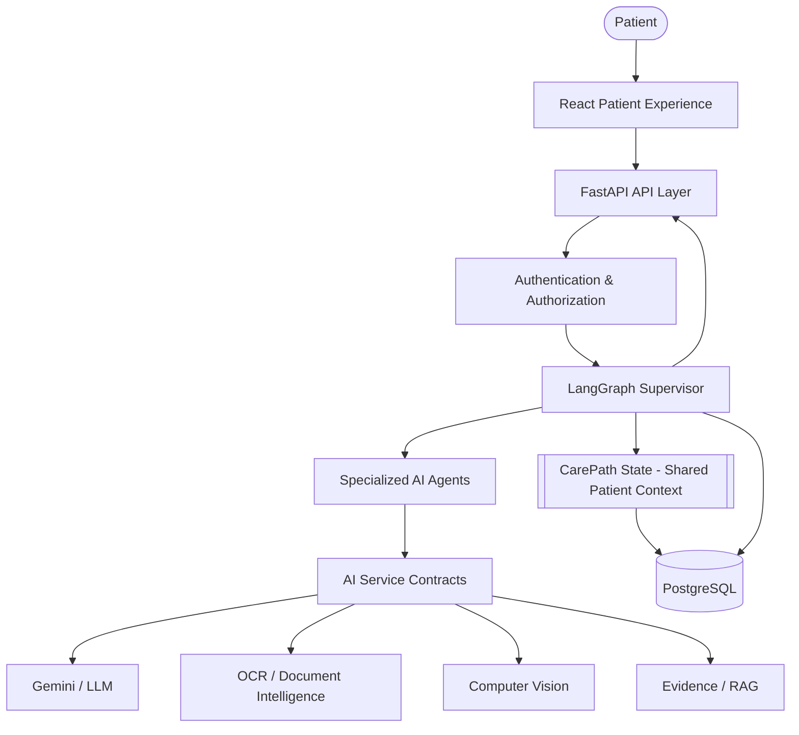
```mermaid
flowchart TD

 PATIENT(["Patient"])

 UI["React Patient Experience"]

 API["FastAPI API Layer"]

 AUTH["Authentication & Authorization"]

 SUP["LangGraph Supervisor"]

 STATE[["CarePath State - Shared Patient Context"]]

 AGENTS["Specialized AI Agents"]

 SERVICES["AI Service Contracts"]

 GEMINI["Gemini / LLM"]
 OCR["OCR / Document Intelligence"]
 VISION["Computer Vision"]
 RAG["Evidence / RAG"]

 DB[("PostgreSQL")]

 PATIENT --> UI
 UI --> API
 API --> AUTH
 AUTH --> SUP

 SUP --> STATE
 SUP --> AGENTS

 AGENTS --> SERVICES

 SERVICES --> GEMINI
 SERVICES --> OCR
 SERVICES --> VISION
 SERVICES --> RAG

 STATE --> DB

 SUP --> DB

 SUP --> API
```
The architecture separates presentation, API orchestration, agent
intelligence, AI capabilities, and persistent patient data into
independent layers. This allows individual components to evolve without
coupling the entire healthcare workflow to a single model or service.

---


## 🤖 1. AI & Multi-Agent Intelligence Domain

> *The intelligence layer of CarePath AI. It transforms patient inputs,
> medical documents, contextual information, and retrieved evidence into
> structured healthcare-navigation workflows.*

| Feature | Technical Breakdown & Capability |
| :--- | :--- |
| 🧠 **LangGraph Supervisor** | Acts as the central orchestrator and determines which specialized agent should execute based on the current CarePath state. |
| 📥 **Intake Agent** | Structures symptoms, patient context, history, encounter information, and user intent for downstream agents. |
| 📄 **Medical Records Agent** | Processes supported medical reports, prescriptions, and extracted document information into structured context. |
| 👁️ **Vision Agent** | Handles supported medical-image analysis through the Computer Vision service contract. |
| 🛡️ **Safety Agent** | Evaluates configured safety signals and can interrupt the normal workflow when priority handling is required. |
| 🧩 **Clinical Reasoning Agent** | Combines patient context, timeline information, document findings, and retrieved evidence into structured reasoning. |
| 📚 **Evidence Agent** | Retrieves relevant supporting information through the RAG layer and provides evidence for explainable outputs. |
| 🩺 **Referral Agent** | Uses available context and reasoning to generate specialist-navigation guidance with an explainable rationale. |
| 👨‍⚕️ **Doctor Bridge** | Produces a doctor-ready summary, generates case-specific questions, and supports clinician review of AI-generated information. |
| 📝 **Care Plan Agent** | Organizes relevant context into structured next steps and monitoring guidance while preserving clinician input. |
| 💊 **Medication Agent** | Processes prescription-derived medication information and supports patient-confirmed medication workflows. |
| 🔔 **Follow-up Agent** | Coordinates follow-up workflows, monitoring, reminders, and escalation paths. |
| 🤝 **Human-in-the-Loop** | Allows an AI workflow to pause for clinician review and resume with expert feedback incorporated into the shared state. |

### 🔄 LangGraph Workflow

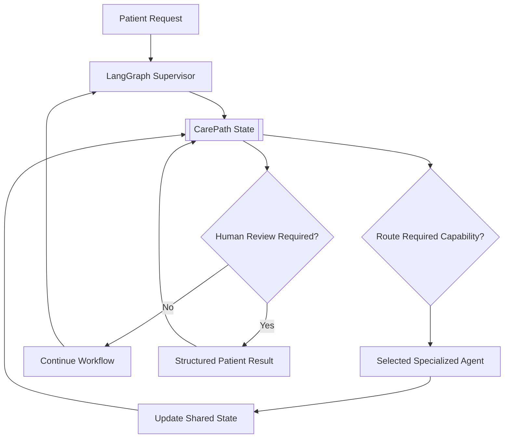
```mermaid
flowchart TD
    REQUEST["Patient Request"]
    SUPERVISOR["LangGraph Supervisor"]
    STATE[["CarePath State"]]
    ROUTE{"Route Required Capability?"}
    AGENT["Selected Specialized Agent"]
    UPDATE["Update Shared State"]
    REVIEW{"Human Review Required?"}
    CONTINUE["Continue Workflow"]
    OUTPUT["Structured Patient Result"]

    REQUEST --> SUPERVISOR
    SUPERVISOR --> STATE
    STATE --> ROUTE
    ROUTE --> AGENT
    AGENT --> UPDATE
    UPDATE --> STATE
    STATE --> REVIEW
    REVIEW -->|Yes| OUTPUT
    REVIEW -->|No| CONTINUE
    CONTINUE --> SUPERVISOR
    OUTPUT --> STATE
```

### 🤖 AI Agent Workflow

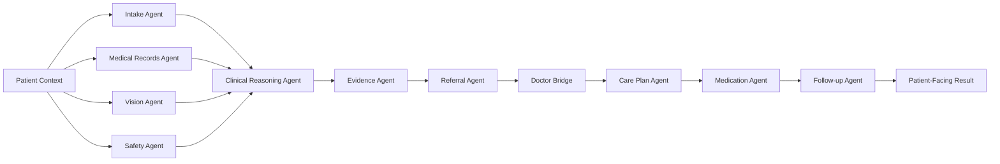
```mermaid
flowchart LR
    INPUT["Patient Context"]
    INTAKE["Intake Agent"]
    RECORDS["Medical Records Agent"]
    VISION["Vision Agent"]
    REASONING["Clinical Reasoning Agent"]
    EVIDENCE["Evidence Agent"]
    SAFETY["Safety Agent"]
    REFERRAL["Referral Agent"]
    DOCTOR["Doctor Bridge"]
    CARE["Care Plan Agent"]
    MEDICATION["Medication Agent"]
    FOLLOWUP["Follow-up Agent"]
    RESULT["Patient-Facing Result"]

    INPUT --> INTAKE
    INPUT --> RECORDS
    INPUT --> VISION
    INPUT --> SAFETY

    INTAKE --> REASONING
    RECORDS --> REASONING
    VISION --> REASONING
    SAFETY --> REASONING

    REASONING --> EVIDENCE
    EVIDENCE --> REFERRAL
    REFERRAL --> DOCTOR
    DOCTOR --> CARE
    CARE --> MEDICATION
    MEDICATION --> FOLLOWUP
    FOLLOWUP --> RESULT
```
### Design Principle

CarePath AI does not rely on a fixed sequence where every patient must
pass through every agent.

The LangGraph Supervisor evaluates the current shared state and routes
the workflow to the capabilities required for the current interaction.

```text
Current Patient State
        ↓
Determine Required Capability
        ↓
Execute Specialized Agent
        ↓
Update Shared State
        ↓
Re-evaluate
        ↓
Continue / Interrupt / Complete
```
> **Unlike a fixed sequential pipeline, CarePath AI uses a shared state and conditional agent routing. The LangGraph Supervisor determines which capabilities are required for the current patient context and coordinates the appropriate agents.**

---


## 🧠 2. Patient & Clinical Intelligence Domain

> *The continuity layer of CarePath AI. It transforms fragmented healthcare information into persistent patient context, chronological history, evidence-backed guidance, doctor-ready information, and personalized next steps.*

| Feature | Technical Breakdown & Capability |
| :--- | :--- |
| 🧠 **CarePath Memory** | Retains relevant patient context across interactions so subsequent workflows can use previously available information instead of starting from zero. |
| 🕐 **AI-Generated Patient Timeline** | Organizes symptoms, consultations, medical documents, prescriptions, referrals, care plans, and follow-ups into a chronological healthcare journey. |
| 📄 **Smart Document Analyzer** | Processes supported reports and prescriptions, extracts relevant information, and makes the resulting context available to downstream workflows. |
| 📚 **Evidence-Backed Guidance** | Connects healthcare-navigation workflows with retrieved evidence through the RAG layer, allowing supporting sources to accompany relevant outputs. |
| 🩺 **Explainable Referral Card** | Summarizes relevant medical history, current symptoms, identified problems, reasoning, and supporting evidence so the specialist recommendation is understandable. |
| 👨‍⚕️ **CarePath Doctor Bridge** | Handles the doctor interaction layer by preparing a concise patient summary, generating case-specific questions, and supporting expert review of AI-generated outputs. |
| 📝 **Personalized Care Plan** | Organizes relevant patient context and clinician input into structured next steps, monitoring points, and follow-up guidance. |
| 💊 **Medication Companion** | Extracts medication information from supported prescriptions and connects confirmed medication details with reminder and adherence workflows. |
| 🔔 **Follow-up Intelligence** | Extends the healthcare journey beyond the initial consultation through check-ins, follow-up scheduling, treatment-response tracking, and escalation workflows. |

### 🔄 Patient Continuity

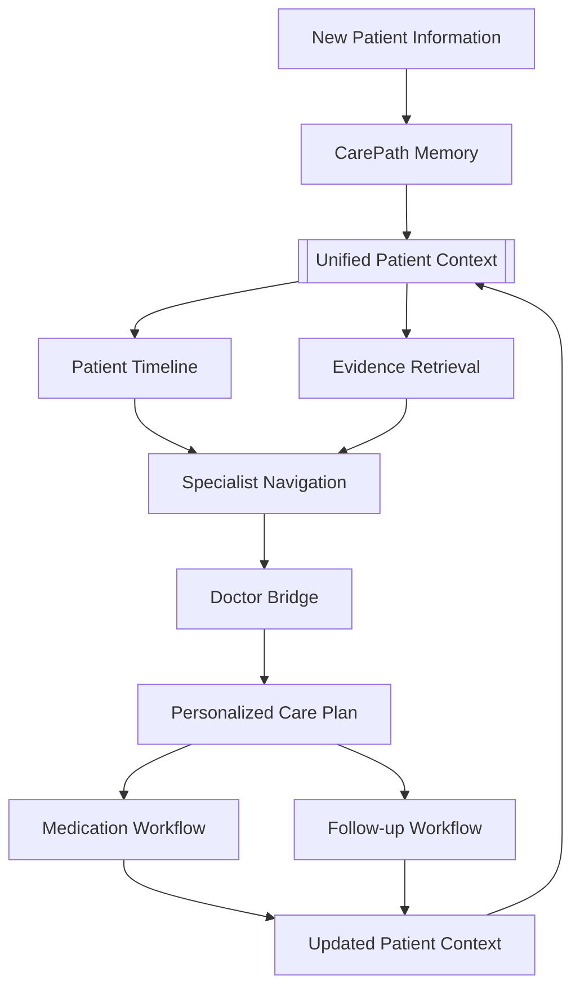
```mermaid
flowchart TD
    INPUT["New Patient Information"]
    MEMORY["CarePath Memory"]
    CONTEXT[["Unified Patient Context"]]
    TIMELINE["Patient Timeline"]
    EVIDENCE["Evidence Retrieval"]
    REFERRAL["Specialist Navigation"]
    DOCTOR["Doctor Bridge"]
    CARE["Personalized Care Plan"]
    MEDICATION["Medication Workflow"]
    FOLLOWUP["Follow-up Workflow"]
    UPDATED["Updated Patient Context"]

    INPUT --> MEMORY
    MEMORY --> CONTEXT
    CONTEXT --> TIMELINE
    CONTEXT --> EVIDENCE
    TIMELINE --> REFERRAL
    EVIDENCE --> REFERRAL
    REFERRAL --> DOCTOR
    DOCTOR --> CARE
    CARE --> MEDICATION
    CARE --> FOLLOWUP
    MEDICATION --> UPDATED
    FOLLOWUP --> UPDATED
    UPDATED --> CONTEXT
```

### Continuity Principle


CarePath AI treats the patient's healthcare journey as **persistent
context rather than isolated conversations**.

New symptoms, documents, consultations, referrals, clinician feedback,
medication information, care plans, and follow-up events can contribute
to the patient's evolving context.

```text
New Information
       ↓
Patient Context
       ↓
Timeline + Memory
       ↓
Evidence + Reasoning
       ↓
Doctor Interaction
       ↓
Care Plan
       ↓
Medication + Follow-up
       ↓
Updated Patient Context
```
---


## 🎨 3. Frontend & Patient Experience Domain

> *The patient-facing experience layer of CarePath AI. It transforms complex AI workflows and clinical information into a clear, accessible, and actionable healthcare journey.*

| Feature | Technical Breakdown & Capability |
| :--- | :--- |
| 📊 **CarePath Dashboard** | Provides a centralized view of the patient's current healthcare journey, timeline, care plan, medications, referrals, and upcoming follow-ups. |
| 🕐 **Patient Timeline Interface** | Presents symptoms, consultations, documents, prescriptions, referrals, and follow-up events as a chronological healthcare journey. |
| 📄 **Document Upload Interface** | Allows patients to securely upload supported medical reports, prescriptions, and other healthcare documents for processing. |
| 🩺 **Referral Card Interface** | Presents the recommended specialist, supporting reasoning, relevant patient context, and evidence in an understandable format. |
| 👨‍⚕️ **Doctor Bridge Interface** | Presents the doctor-ready summary, case-specific questions, and clinician-review workflow before and during consultation. |
| 💊 **Medication Interface** | Displays confirmed medication information, schedules, reminders, and adherence-related actions. |
| 📝 **Care Plan Interface** | Converts the personalized care plan into clear actions, monitoring points, and follow-up steps for the patient. |
| 📚 **Evidence Presentation** | Displays relevant evidence and supporting sources returned by the RAG workflow without overwhelming the patient with technical information. |
| 🔔 **Follow-up Experience** | Provides reminders, check-ins, progress updates, and follow-up actions throughout the patient's journey. |
| 📡 **Real-Time Workflow Updates** | Uses Server-Sent Events (SSE) to display workflow progress while long-running backend and agent operations are executing. |
| 🌐 **Responsive Experience** | Provides a consistent experience across desktop and mobile layouts while keeping important healthcare information easy to access. |

### 🔄 Frontend Communication

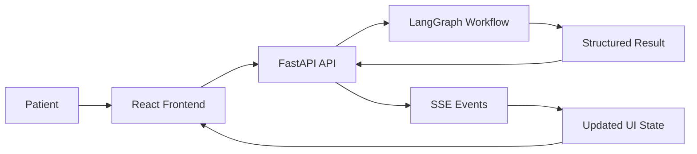
```mermaid
flowchart LR
    PATIENT["Patient"]
    UI["React Frontend"]
    API["FastAPI API"]
    WORKFLOW["LangGraph Workflow"]
    RESULT["Structured Result"]
    SSE["SSE Events"]
    UI_STATE["Updated UI State"]

    PATIENT --> UI
    UI --> API
    API --> WORKFLOW
    WORKFLOW --> RESULT
    RESULT --> API
    API --> SSE
    SSE --> UI_STATE
    UI_STATE --> UI
```

### Frontend Design Principle

The frontend does not directly communicate with individual AI agents.

Instead, all agent execution is mediated through the backend API layer.

```text
Patient
   ↓
React Interface
   ↓
FastAPI API
   ↓
LangGraph Workflow
   ↓
Structured Result
   ↓
FastAPI
   ↓
JSON + SSE Events
   ↓
React Interface
   ↓
Patient


```
---


## ⚙️ 4. Backend & Integration Domain

> *The engineering backbone of CarePath AI. The backend provides secure APIs, authentication, validation, workflow orchestration, AI service integration, real-time communication, and persistence across the healthcare journey.*

| Component | Technical Breakdown & Capability |
| :--- | :--- |
| ⚡ **FastAPI API Layer** | Provides REST endpoints between the React application and backend services. |
| 🔐 **Authentication & Authorization** | Protects patient resources using JWT-based authentication and authorization controls. |
| 🛣️ **API Routers** | Organizes endpoints by functional domain while keeping HTTP concerns separated from application logic. |
| ⚙️ **Service Layer** | Coordinates application logic, patient workflows, persistence, and LangGraph execution. |
| ✅ **Pydantic Validation** | Validates incoming requests and structures outgoing responses using typed schemas. |
| 🤖 **LangGraph Integration** | Connects backend requests to stateful multi-agent workflows and conditional agent routing. |
| 🧠 **CarePath State** | Maintains shared context between agents throughout an active workflow. |
| 🔗 **AI Service Contracts** | Provides provider-independent interfaces for LLM, OCR, Computer Vision, and evidence-retrieval capabilities. |
| 📡 **SSE Streaming** | Streams agent execution, workflow progress, human-review requests, completion, and failure events to the frontend. |
| 🗄️ **Database Integration** | Connects backend services with the persistent healthcare data layer through defined repository/data-access interfaces. |
| ⚠️ **Error Handling** | Converts validation, service, AI, and workflow failures into controlled API responses. |
| 📝 **Logging & Observability** | Captures relevant backend and workflow events to support debugging and operational visibility. |
| 🛡️ **Security Boundaries** | Separates authentication, patient data access, AI processing, and workflow execution to reduce unnecessary coupling and exposure. |

### 🧩 Backend Architecture

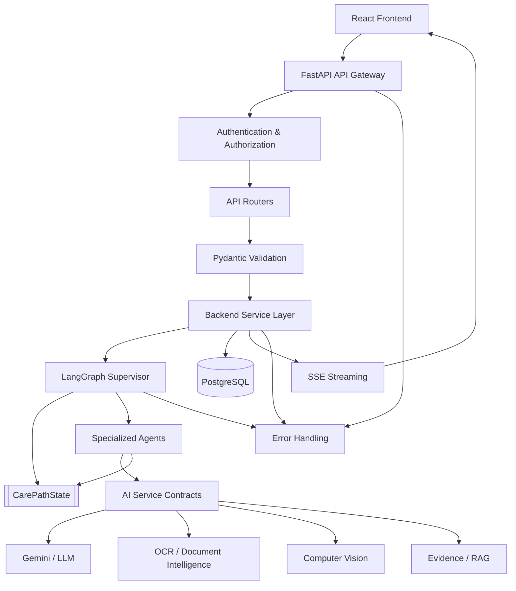
```mermaid
flowchart TD

 CLIENT["React Frontend"]

 API["FastAPI API Gateway"]

 AUTH["Authentication & Authorization"]

 ROUTERS["API Routers"]

 VALIDATION["Pydantic Validation"]

 SERVICE["Backend Service Layer"]

 GRAPH["LangGraph Supervisor"]

 STATE[["CarePathState"]]

 AGENTS["Specialized Agents"]

 CONTRACTS["AI Service Contracts"]

 LLM["Gemini / LLM"]

 OCR["OCR / Document Intelligence"]

 VISION["Computer Vision"]

 RAG["Evidence / RAG"]

 DB[("PostgreSQL")]

 SSE["SSE Streaming"]

 ERRORS["Error Handling"]

 CLIENT --> API

 API --> AUTH
 AUTH --> ROUTERS

 ROUTERS --> VALIDATION
 VALIDATION --> SERVICE

 SERVICE --> GRAPH
 SERVICE --> DB

 GRAPH --> STATE
 GRAPH --> AGENTS

 AGENTS --> CONTRACTS

 CONTRACTS --> LLM
 CONTRACTS --> OCR
 CONTRACTS --> VISION
 CONTRACTS --> RAG

 AGENTS --> STATE


 SERVICE --> SSE
 SSE --> CLIENT

 API --> ERRORS
 SERVICE --> ERRORS
 GRAPH --> ERRORS
```
### 🔗 AI Service Isolation

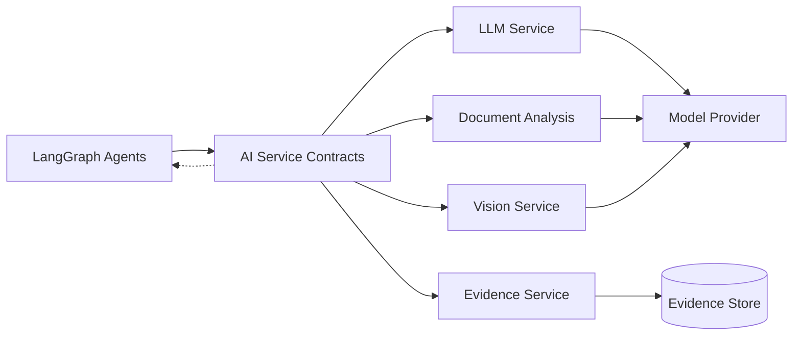
```mermaid
flowchart LR
    AGENTS["LangGraph Agents"]
    CONTRACT["AI Service Contracts"]
    LLM["LLM Service"]
    DOCUMENT["Document Analysis"]
    VISION["Vision Service"]
    EVIDENCE["Evidence Service"]
    PROVIDER["Model Provider"]
    VECTOR[("Evidence Store")]

    AGENTS --> CONTRACT
    CONTRACT --> LLM
    CONTRACT --> DOCUMENT
    CONTRACT --> VISION
    CONTRACT --> EVIDENCE

    LLM --> PROVIDER
    DOCUMENT --> PROVIDER
    VISION --> PROVIDER
    EVIDENCE --> VECTOR

    CONTRACT -.-> AGENTS
```

The service-contract approach keeps the orchestration layer independent
of individual AI providers and model implementations.

```text
LangGraph Agent
       ↓
AI Service Contract
       ↓
Provider / Implementation
       ↓
Structured Result
       ↓
Agent State
```

This makes individual AI capabilities replaceable without requiring the
entire backend or agent graph to be rewritten.

### Backend Design Principles

| Principle | Implementation |
| :--- | :--- |
| **Separation of Concerns** | API routes, services, agents, schemas, and AI integrations remain independently structured. |
| **Stateful Orchestration** | LangGraph manages workflow state through the shared `CarePathState`. |
| **Provider Independence** | AI capabilities are accessed through service contracts rather than direct model coupling. |
| **Human Oversight** | Workflows can pause for clinician review where required. |
| **Secure Access** | Authentication and authorization are enforced before protected patient operations. |
| **Real-Time Feedback** | SSE provides workflow progress to the frontend without requiring continuous polling. |
| **Testability** | Backend services and AI integrations can be tested independently using controlled service implementations and mocks. |
| **Extensibility** | New agents and AI capabilities can be added without redesigning the entire API layer. |

---


# 🗄️ Database Architecture

CarePath AI uses a structured relational data layer to maintain patient
context, healthcare encounters, documents, medications, care plans,
referrals, timelines, and follow-up information.

The database acts as the persistent source of truth for the patient's
healthcare journey, while LangGraph's `CarePathState` manages the
**active state of an AI workflow**.

## Database Architecture

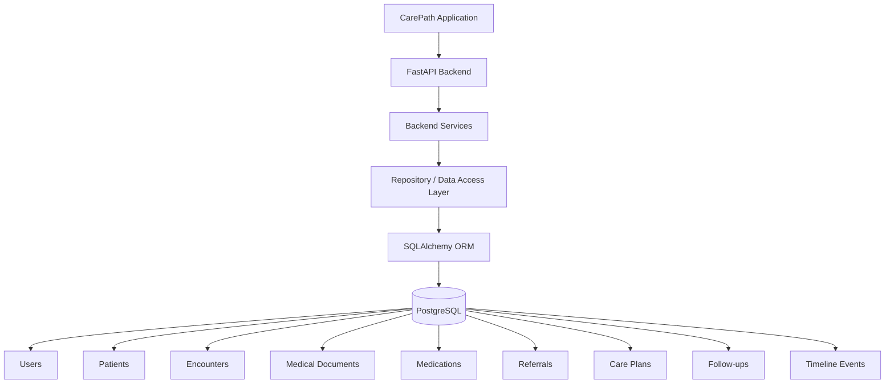
```mermaid
flowchart TD

 APP["CarePath Application"]

 API["FastAPI Backend"]

 SERVICES["Backend Services"]

 REPOSITORY["Repository / Data Access Layer"]

 ORM["SQLAlchemy ORM"]

 DB[("PostgreSQL")]

 USER["Users"]

 PATIENT["Patients"]

 ENCOUNTER["Encounters"]

 DOCUMENT["Medical Documents"]

 MEDICATION["Medications"]

 REFERRAL["Referrals"]

 CAREPLAN["Care Plans"]

 FOLLOWUP["Follow-ups"]

 TIMELINE["Timeline Events"]

 APP --> API

 API --> SERVICES

 SERVICES --> REPOSITORY

 REPOSITORY --> ORM

 ORM --> DB

 DB --> USER
 DB --> PATIENT
 DB --> ENCOUNTER
 DB --> DOCUMENT
 DB --> MEDICATION
 DB --> REFERRAL
 DB --> CAREPLAN
 DB --> FOLLOWUP
 DB --> TIMELINE
```


### Persistence Flow

```text
Patient Interaction
        ↓
FastAPI Endpoint
        ↓
Backend Service
        ↓
Repository / Data Access
        ↓
SQLAlchemy ORM
        ↓
PostgreSQL
        ↓
Persistent Healthcare Data
```

---


## 🧩 Core Data Domains

| Data Domain | Purpose |
| :--- | :--- |
| 👤 **Users** | Stores authenticated user information and access-related data. |
| 🧑 **Patients** | Maintains patient profile and healthcare-navigation context. |
| 🩺 **Encounters** | Represents consultations and healthcare interactions. |
| 📄 **Medical Documents** | Maintains uploaded document metadata and associated patient/encounter context. |
| 💊 **Medications** | Stores medication information extracted from or associated with prescriptions and patient workflows. |
| 🩺 **Referrals** | Stores specialist-navigation information and referral status. |
| 📝 **Care Plans** | Stores personalized care plans and associated actions. |
| 🔔 **Follow-ups** | Maintains scheduled and completed follow-up activities. |
| 🕐 **Timeline Events** | Represents chronological events that contribute to the patient's healthcare journey. |

---


---

## Entity Relationship Architecture

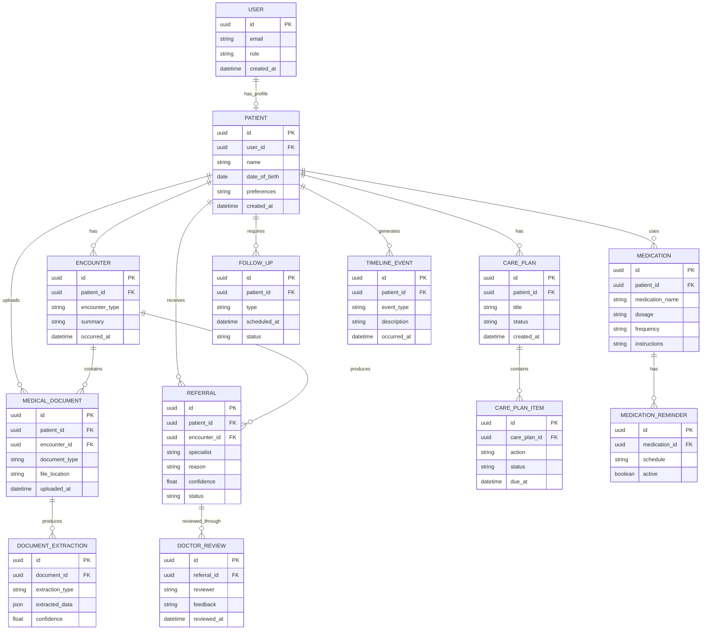
```mermaid
erDiagram
    USER ||--o| PATIENT : has_profile
    PATIENT ||--o{ ENCOUNTER : has
    PATIENT ||--o{ MEDICAL_DOCUMENT : uploads
    PATIENT ||--o{ MEDICATION : uses
    PATIENT ||--o{ REFERRAL : receives
    PATIENT ||--o{ CARE_PLAN : has
    PATIENT ||--o{ FOLLOW_UP : requires
    PATIENT ||--o{ TIMELINE_EVENT : generates
    ENCOUNTER ||--o{ MEDICAL_DOCUMENT : contains
    ENCOUNTER ||--o{ REFERRAL : produces
    MEDICAL_DOCUMENT ||--o{ DOCUMENT_EXTRACTION : produces
    REFERRAL ||--o{ DOCTOR_REVIEW : reviewed_through
    CARE_PLAN ||--o{ CARE_PLAN_ITEM : contains
    MEDICATION ||--o{ MEDICATION_REMINDER : has
    USER {
    uuid id PK
    string email
    string role
    datetime created_at
    }
    PATIENT {
    uuid id PK
    uuid user_id FK
    string name
    date date_of_birth
    string preferences
    datetime created_at
    }
    ENCOUNTER {
    uuid id PK
    uuid patient_id FK
    string encounter_type
    string summary
    datetime occurred_at
    }
    MEDICAL_DOCUMENT {
    uuid id PK
    uuid patient_id FK
    uuid encounter_id FK
    string document_type
    string file_location
    datetime uploaded_at
    }
    DOCUMENT_EXTRACTION {
    uuid id PK
    uuid document_id FK
    string extraction_type
    json extracted_data
    float confidence
    }
    MEDICATION {
    uuid id PK
    uuid patient_id FK
    string medication_name
    string dosage
    string frequency
    string instructions
    }
    MEDICATION_REMINDER {
    uuid id PK
    uuid medication_id FK
    string schedule
    boolean active
    }
    REFERRAL {
    uuid id PK
    uuid patient_id FK
    uuid encounter_id FK
    string specialist
    string reason
    float confidence
    string status
    }
    DOCTOR_REVIEW {
    uuid id PK
    uuid referral_id FK
    string reviewer
    string feedback
    datetime reviewed_at
    }
    CARE_PLAN {
    uuid id PK
    uuid patient_id FK
    string title
    string status
    datetime created_at
    }
    CARE_PLAN_ITEM {
    uuid id PK
    uuid care_plan_id FK
    string action
    string status
    datetime due_at
    }
    FOLLOW_UP {
    uuid id PK
    uuid patient_id FK
    string type
    datetime scheduled_at
    string status
    }
    TIMELINE_EVENT {
    uuid id PK
    uuid patient_id FK
    string event_type
    string description
    datetime occurred_at
    }
```


## Database Responsibilities

| Component | Responsibility |
| :--- | :--- |
| 👤 **User & Patient Data** | Stores authenticated user information and the associated patient profile. |
| 🩺 **Encounter Data** | Maintains consultation and healthcare interaction records. |
| 📄 **Medical Documents** | Stores document metadata and references to uploaded medical files. |
| 🔍 **Document Extraction** | Stores structured information produced from supported document-analysis workflows. |
| 💊 **Medication Data** | Maintains patient-confirmed medication information used by medication workflows. |
| 🩺 **Referral Data** | Stores specialist-navigation results, rationale, confidence, and status. |
| 👨‍⚕️ **Doctor Review** | Persists clinician feedback and human-in-the-loop review information. |
| 📝 **Care Plans** | Stores personalized care plans and their individual action items. |
| 🔔 **Follow-ups** | Maintains scheduled follow-up activities and their status. |
| 🕐 **Patient Timeline** | Provides a persistent chronological representation of the patient's healthcare journey. |


### Persistence Principle

```text
                    ┌──────────────────────┐
                    │    Patient Context   │
                    └──────────┬───────────┘
                               ↓
              ┌────────────────────────────────┐
              │           PostgreSQL            │
              ├────────────────────────────────┤
              │ Encounters                      │
              │ Documents                       │
              │ Medications                     │
              │ Referrals                       │
              │ Doctor Reviews                  │
              │ Care Plans                      │
              │ Follow-ups                      │
              │ Timeline Events                 │
              └────────────────────────────────┘
                               ↑
                               │
                    ┌──────────┴───────────┐
                    │   Backend Services   │
                    │   + LangGraph        │
                    └──────────────────────┘
```

> **PostgreSQL provides persistent healthcare data, while LangGraph manages
> transient workflow state during multi-agent execution.**


### Core Tables

- Users
- PatientProfile
- MedicalFiles
- SymptomSessions
- PatientSymptoms
- AIAnalysis
- Recommendations
- CarePlans
- FollowUps
- Notifications
- Medications
- Visits
- FamilyMembers
- Feedback
- AuditHistory
- AgentRuns
- TimelineEvents
- EvidenceRetrieval

---


---

## 🧠 Persistent Data vs AI Workflow State

CarePath separates **long-term patient information** from **temporary
agent execution state**.

| Layer | Responsibility |
| :--- | :--- |
| 🗄️ **PostgreSQL** | Persistent patient and healthcare application data. |
| 🔗 **SQLAlchemy** | Provides the application's ORM/data-access abstraction. |
| 🧠 **CarePathState** | Carries the active context between LangGraph agents during a workflow. |
| 🤖 **LangGraph** | Coordinates agent execution and state transitions. |
| 📚 **ChromaDB / Vector Store** | Supports evidence retrieval for RAG workflows. |

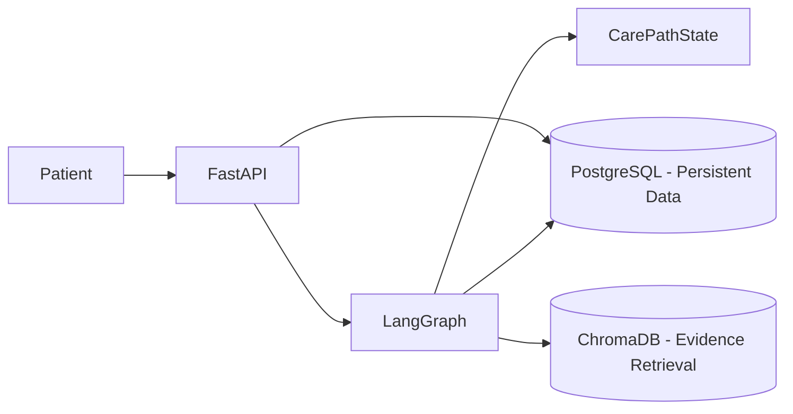
```mermaid
flowchart LR

 PATIENT["Patient"]

 API["FastAPI"]

 GRAPH["LangGraph"]

 STATE["CarePathState"]

 POSTGRES[("PostgreSQL - Persistent Data")]

 VECTOR[("ChromaDB - Evidence Retrieval")]

 PATIENT --> API

 API --> GRAPH

 GRAPH --> STATE

 API --> POSTGRES
 GRAPH --> POSTGRES

 GRAPH --> VECTOR
```

> **PostgreSQL stores persistent healthcare data, while `CarePathState`
> carries active workflow context between agents. ChromaDB supports the
> evidence-retrieval layer rather than acting as the primary patient database.**

---


# 🔌 API Architecture & Endpoints

The CarePath backend exposes a RESTful API through FastAPI. The API layer
acts as the controlled entry point between the frontend, authentication
system, LangGraph workflows, AI services, and persistent data layer.

## API Request Architecture

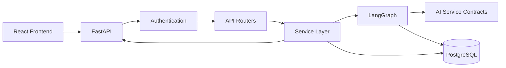
```mermaid
flowchart LR

 CLIENT["React Frontend"]

 API["FastAPI"]

 AUTH["Authentication"]

 ROUTER["API Routers"]

 SERVICE["Service Layer"]

 GRAPH["LangGraph"]

 DB[("PostgreSQL")]

 AI["AI Service Contracts"]

 CLIENT --> API
 API --> AUTH
 AUTH --> ROUTER

 ROUTER --> SERVICE

 SERVICE --> GRAPH
 SERVICE --> DB

 GRAPH --> AI
 GRAPH --> DB

 SERVICE --> API
```

---

## 📡 API Endpoint Categories

| Category | Purpose | Communication |
| :--- | :--- | :--- |
| 🔐 **Authentication** | User registration, login, token handling, and protected-resource access. | REST / JSON |
| 👤 **Patient** | Patient profile and healthcare-navigation information. | REST / JSON |
| 🩺 **Encounters** | Create and retrieve patient healthcare encounters. | REST / JSON |
| 📄 **Documents** | Upload and manage medical documents for downstream analysis. | REST / Multipart |
| 🤖 **AI Workflows** | Start and interact with LangGraph-powered healthcare workflows. | REST / JSON |
| 📡 **Workflow Streaming** | Stream active agent execution and workflow events to the frontend. | SSE |
| 🩺 **Referral** | Retrieve specialist-navigation results and referral information. | REST / JSON |
| 📝 **Care Plans** | Retrieve and manage personalized care-plan information. | REST / JSON |
| 💊 **Medication** | Access medication information and reminder-related workflows. | REST / JSON |
| 🔔 **Follow-up** | Manage follow-up activities and patient-care continuity. | REST / JSON |

### Core AI Agents

| Agent | Responsibility |
|---------|---------------|
| Intake Agent | Collects and structures patient symptoms |
| Vision Agent | Analyzes uploaded medical images |
| Medical Records Agent | Extracts information from reports and prescriptions |
| Clinical Reasoning Agent | Performs healthcare reasoning |
| Referral Agent | Identifies appropriate specialists |
| Safety Agent | Detects risks and safety concerns |
| Follow-Up Agent | Tracks care progress and future actions |
| Evidence Agent | Retrieves supporting medical evidence using RAG |

---


# 🔄 End-to-End Data Flow

CarePath AI transforms fragmented patient information into a continuous,
context-aware healthcare navigation workflow.

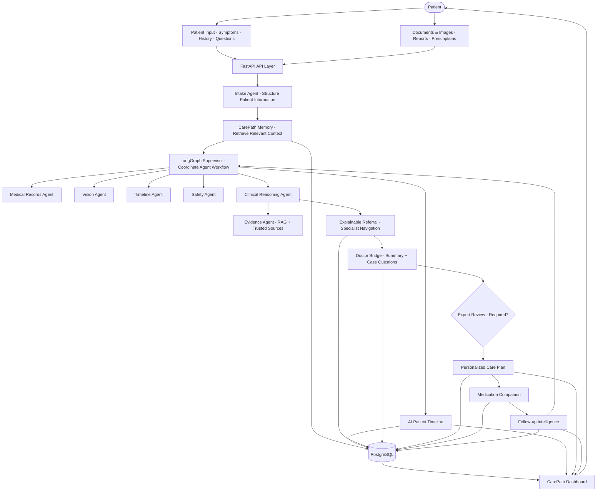
```mermaid
flowchart TD

 PATIENT(["Patient"])

 INPUT["Patient Input - Symptoms - History - Questions"]

 UPLOAD["Documents & Images - Reports - Prescriptions"]

 API["FastAPI API Layer"]

 INTAKE["Intake Agent - Structure Patient Information"]

 MEMORY["CarePath Memory - Retrieve Relevant Context"]

 SUP["LangGraph Supervisor - Coordinate Agent Workflow"]

 RECORDS["Medical Records Agent"]

 VISION["Vision Agent"]

 TIMELINE["Timeline Agent"]

 SAFETY["Safety Agent"]

 REASONING["Clinical Reasoning Agent"]

 EVIDENCE["Evidence Agent - RAG + Trusted Sources"]

 REFERRAL["Explainable Referral - Specialist Navigation"]

 DOCTOR["Doctor Bridge - Summary + Case Questions"]

 REVIEW{"Expert Review - Required?"}

 CARE["Personalized Care Plan"]

 MEDICATION["Medication Companion"]

 FOLLOWUP["Follow-up Intelligence"]

 TIMELINE_OUT["AI Patient Timeline"]

 DB[("PostgreSQL")]

 DASHBOARD["CarePath Dashboard"]

 PATIENT --> INPUT
 PATIENT --> UPLOAD

 INPUT --> API
 UPLOAD --> API

 API --> INTAKE

 INTAKE --> MEMORY

 MEMORY --> SUP

 SUP --> RECORDS
 SUP --> VISION
 SUP --> TIMELINE
 SUP --> SAFETY


 SUP --> REASONING

 REASONING --> EVIDENCE

 REASONING --> REFERRAL

 REFERRAL --> DOCTOR

 DOCTOR --> REVIEW

 REVIEW --> CARE

 CARE --> MEDICATION
 MEDICATION --> FOLLOWUP

 FOLLOWUP --> SUP

 SUP --> TIMELINE_OUT

 MEMORY --> DB
 TIMELINE_OUT --> DB
 REFERRAL --> DB
 DOCTOR --> DB
 CARE --> DB
 MEDICATION --> DB
 FOLLOWUP --> DB

 DB --> DASHBOARD
 TIMELINE_OUT --> DASHBOARD
 CARE --> DASHBOARD
 FOLLOWUP --> DASHBOARD

 DASHBOARD --> PATIENT
```

### 🔄 End-to-End Data Flow & Data Transformation


```mermaid
flowchart LR
    INPUT["Raw Patient Information"]
    CONTEXT["Structured Patient Context"]
    STATE[["CarePath State"]]
    AGENTS["Specialized AI Agents"]
    REASONING["Clinical Reasoning"]
    EVIDENCE["Evidence and RAG"]
    NAVIGATION["Explainable Specialist Navigation"]
    DOCTOR["Doctor Bridge"]
    CARE["Personalized Care"]
    FOLLOWUP["Medication and Follow-up"]
    TIMELINE["Patient Timeline"]
    DASHBOARD["Patient Dashboard"]

    INPUT --> CONTEXT
    CONTEXT --> STATE
    STATE --> AGENTS
    AGENTS --> REASONING
    REASONING --> EVIDENCE
    EVIDENCE --> NAVIGATION
    NAVIGATION --> DOCTOR
    DOCTOR --> CARE
    CARE --> FOLLOWUP
    FOLLOWUP --> TIMELINE
    TIMELINE --> DASHBOARD
    TIMELINE --> STATE
```

> **The key distinction is that CarePath is not a one-way pipeline. Follow-up information and new patient interactions are fed back into the patient's persistent context, allowing subsequent workflows to build on the existing healthcare journey.**


---


<a id="core-modules"></a>

# 🧩 Core Modules

CarePath AI follows a modular backend structure in which API handling,
workflow orchestration, AI capabilities, state management, schemas, and
data access remain separated.

## Backend Module Architecture

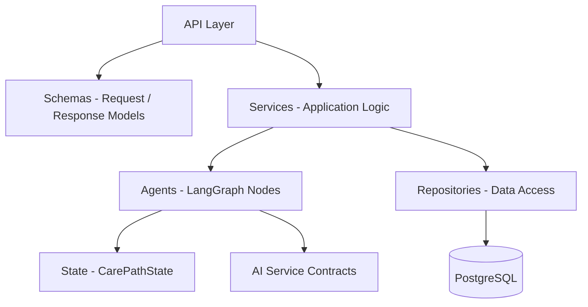
```mermaid
flowchart TD

 API["API Layer"]

 SCHEMAS["Schemas - Request / Response Models"]

 SERVICES["Services - Application Logic"]

 AGENTS["Agents - LangGraph Nodes"]

 STATE["State - CarePathState"]

 CONTRACTS["AI Service Contracts"]

 REPOSITORIES["Repositories - Data Access"]

 DB[("PostgreSQL")]

 API --> SCHEMAS
 API --> SERVICES

 SERVICES --> AGENTS
 SERVICES --> REPOSITORIES

 AGENTS --> STATE
 AGENTS --> CONTRACTS

 REPOSITORIES --> DB
```

---

## 📂 Repository Structure

```text
CarePath-AI/
│
├── frontend/
│   ├── src/
│   │   ├── components/
│   │   ├── pages/
│   │   ├── services/
│   │   ├── hooks/
│   │   └── ...
│   │
│   ├── package.json
│   └── vite.config.*
│
├── backend/
│   ├── src/
│   │   ├── api/
│   │   │   ├── routes/
│   │   │   └── dependencies/
│   │   │
│   │   ├── agents/
│   │   │   ├── supervisor/
│   │   │   ├── safety/
│   │   │   ├── intake/
│   │   │   ├── reasoning/
│   │   │   ├── evidence/
│   │   │   ├── referral/
│   │   │   ├── care_plan/
│   │   │   └── follow_up/
│   │   │
│   │   ├── services/
│   │   ├── schemas/
│   │   ├── state/
│   │   ├── repositories/
│   │   ├── models/
│   │   └── core/
│   │
│   ├── tests/
│   ├── requirements.txt
│   └── Dockerfile
│
├── docs/
│
├── images/
│   └── carepath-ai-logo.png
│
├── docker-compose.yml
├── .env.example
└── README.md
```

> **Note:** Update the tree above to exactly match the repository before
> publishing the final README. The README should document the actual
> project structure rather than an intended future structure.

---

## 🧱 Module Responsibilities

| Module | Responsibility |
| :--- | :--- |
| ⚡ **API** | Defines HTTP endpoints, dependencies, authentication flow, and frontend-facing communication. |
| 🤖 **Agents** | Contains specialized LangGraph agent logic and workflow nodes. |
| 🧠 **State** | Defines the shared `CarePathState` used to transfer context between agents. |
| ⚙️ **Services** | Contains application-level orchestration and integration logic. |
| 📋 **Schemas** | Defines typed request, response, configuration, and structured AI data models. |
| 🔗 **AI Contracts** | Abstracts AI capabilities such as LLM, document analysis, vision, and evidence retrieval. |
| 🗂️ **Repositories** | Provides the data-access abstraction between application services and persistence. |
| 🗄️ **Models** | Defines database/ORM representations where applicable. |
| 🧪 **Tests** | Contains API, service, agent, integration, and workflow validation. |
| 🐳 **Infrastructure** | Provides containerization and environment-specific deployment configuration. |

---


<a id="key-project-metrics"></a>

# 📊 Key Project Metrics

> **Note:** The figures below are placeholders. Replace them with real
> numbers (from your test suite, CI, and issue tracker) before publishing.

| Metric | Value |
| :--- | :--- |
| 🧩 Specialized AI Agents | 12+ |
| 🔌 API Endpoint Categories | 10 |
| 🗄️ Core Data Domains | 9 |
| 🧪 Automated Test Coverage | TBD % |
| 📄 Supported Document Types | Reports · Prescriptions · Lab Results · Imaging |
| ⚡ Avg. Workflow Response Time | TBD ms |
| 🐳 Deployment | Dockerized (Frontend + Backend) |
| 📦 Repository Status | Active Development |

---

# 🧪 Testing & Quality Assurance

CarePath AI follows a layered testing strategy designed to validate the
backend API, multi-agent workflows, service integrations, data handling,
and safety boundaries independently.

The goal is to ensure that changes to individual agents or services do
not silently break the overall healthcare-navigation workflow.

## 🔬 Testing Layers

| Test Layer | What is validated |
| :--- | :--- |
| **Unit Testing** | Individual backend functions, utilities, validators, schemas, and isolated business logic. |
| **API Testing** | FastAPI endpoints, request validation, authentication, response structures, and error handling. |
| **Agent Testing** | Individual LangGraph agents and their state transformations are tested independently. |
| **Workflow Testing** | Supervisor routing, conditional transitions, shared `CarePathState`, workflow completion, and interruption paths. |
| **AI Service Contract Testing** | AI integrations are tested through controlled service contracts so agent logic is not dependent on live model responses. |
| **Integration Testing** | Validates communication between API, services, agents, repositories, and persistence layers. |
| **Safety Testing** | Validates safety-first routing, priority interruption, invalid-input handling, and protected workflow paths. |
| **End-to-End Testing** | Validates complete patient workflows from frontend/API input through agent execution and final response. |

---

## 🤖 LangGraph Workflow Testing

The multi-agent layer is tested around **state transitions and routing
behavior**, rather than treating an LLM response as a deterministic
assertion.

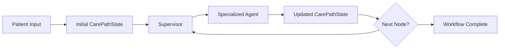
```mermaid
flowchart LR

 INPUT["Patient Input"]

 INITIAL["Initial CarePathState"]

 SUP["Supervisor"]

 AGENT["Specialized Agent"]

 UPDATED["Updated CarePathState"]

 NEXT{"Next Node?"}

 COMPLETE["Workflow Complete"]

 INPUT --> INITIAL
 INITIAL --> SUP
 SUP --> AGENT
 AGENT --> UPDATED
 UPDATED --> NEXT

 NEXT --> SUP
 NEXT --> COMPLETE
```

The workflow tests verify that:

- Required state is created correctly.
- The Supervisor routes to the appropriate capability.
- Agents update the shared state correctly.
- Conditional transitions behave as expected.
- Safety paths can interrupt normal execution.
- Human-review workflows can pause and resume.
- Workflow completion produces a structured result.

### Running Tests

From the backend project directory:

```bash
pytest
```

For verbose output:

```bash
pytest -v
```

For a specific test module:

```bash
pytest tests/<test_file>.py -v
```

For asynchronous tests:

```bash
pytest -v
```

The test suite should be executed before merging changes to backend
services, agent workflows, API contracts, or shared state definitions.

---

## 🔗 AI Service Isolation

AI capabilities are accessed through service contracts, allowing tests
to replace external model calls with deterministic test implementations
or mocks.

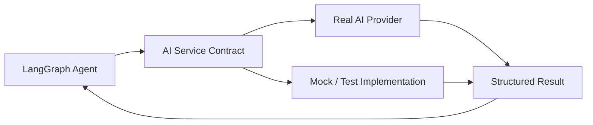
```mermaid
flowchart LR

 AGENT["LangGraph Agent"]

 CONTRACT["AI Service Contract"]

 REAL["Real AI Provider"]

 MOCK["Mock / Test Implementation"]

 RESULT["Structured Result"]

 AGENT --> CONTRACT

 CONTRACT --> REAL
 CONTRACT --> MOCK

 REAL --> RESULT
 MOCK --> RESULT

 RESULT --> AGENT
```

This separation allows the orchestration layer to be tested for routing,
state management, validation, and failure handling without requiring a
live external AI request for every test case.

---

## 🛡️ Safety & Failure Validation

Because CarePath AI operates in a healthcare-navigation context, testing
also considers failure and safety conditions.

| Scenario | Expected Behaviour |
| :--- | :--- |
| **Invalid Request** | Request is rejected through structured validation errors. |
| **Unauthorized Request** | Protected resources remain inaccessible. |
| **AI Service Failure** | Workflow handles the service failure without silently treating it as a successful result. |
| **Missing Patient Context** | Workflow requests or handles missing information rather than assuming unavailable data. |
| **Safety Signal** | Safety workflow takes priority over normal navigation. |
| **Human Review Required** | Workflow can pause and wait for clinician input where supported. |
| **Workflow Failure** | Failure is surfaced through controlled backend responses and streaming events where applicable. |
| **External Dependency Failure** | The system avoids presenting unavailable external information as confirmed results. |

> **Testing validates system behaviour and safety boundaries; it does not
> establish clinical efficacy or replace clinical validation.**


# 📱 Platform Features

## 🌐 Landing Page

The landing page introduces CarePath AI and explains how the platform assists patients throughout their healthcare journey.


---

## 🔐 Login & Authentication

Secure authentication system for accessing patient healthcare information.

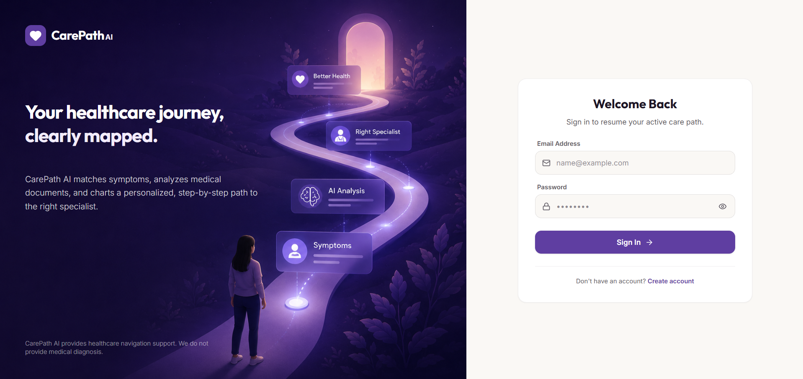

---

## 📊 Dashboard

The dashboard serves as the command center of the platform.

Features include:

- Continuous Care Plan
- Symptom Monitoring
- Medication Reminders
- Recent Activity Tracking
- Healthcare Milestones
- Next Recommended Actions

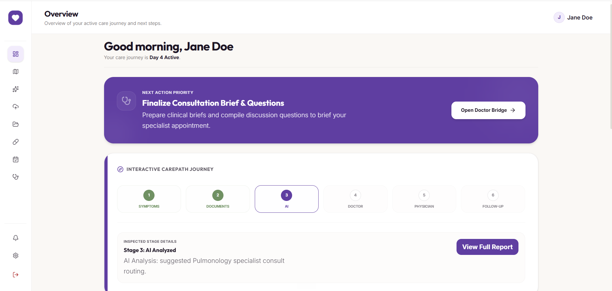

---

## 🛤 My Care Journey

Provides a timeline-based view of the patient's healthcare progression.

Features:

- Healthcare milestones
- Diagnostic history
- Timeline inspection
- Progress tracking
- Event exploration


---

## 🤖 AI Analysis

Displays AI-generated clinical insights and healthcare reasoning.

Features:

- Clinical Findings
- Risk Assessment
- Safety Evaluation
- Specialist Recommendations
- Supporting Evidence

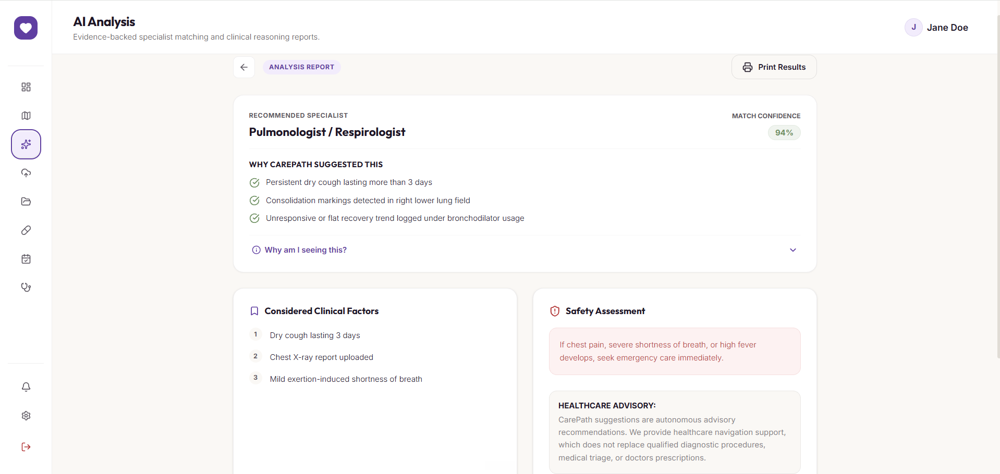

---

## 📂 Upload Center

Centralized document upload system.

Supports:

- Medical Reports
- Prescriptions
- Lab Reports
- Imaging Results
- Consultation Documents

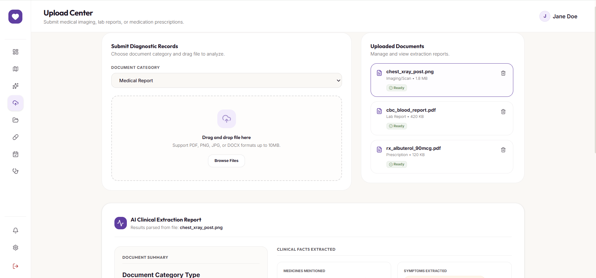

---

## 📑 My Records

Unified patient record management system.

Features:

- Health Records
- Visit History
- Medical Documents
- Treatment History

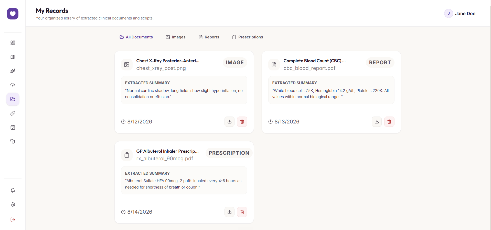

---

## 💊 Medications

Medication management and adherence tracking.

Features:

- Medication Schedule
- Dosage Tracking
- Reminders
- Adherence Monitoring


---

## 🔄 Follow-Up Center

Continuous healthcare monitoring and reassessment.

Features:

- Follow-Up Tasks
- Progress Tracking
- Reassessment Logs
- Health Checkpoints


---

## 👨‍⚕️ Dr Bridge

Bridges communication between AI insights and healthcare professionals.

Features:

- Consultation Preparation
- Question Generation
- Clinical Summaries
- Appointment Assistance

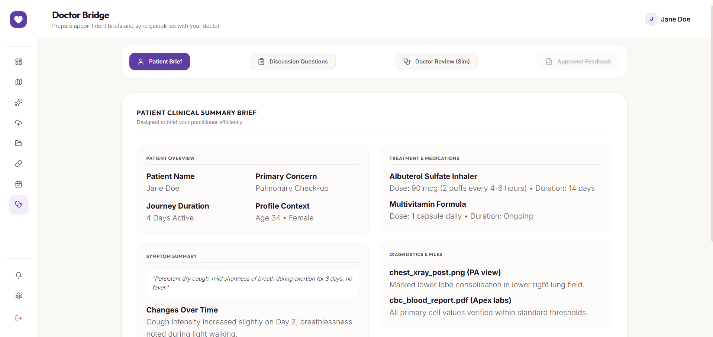

---


<a id="getting-started"></a>

# 🛠 Local Setup

### Clone Repository

```bash
git clone <repository-url>
cd CarePath-AI
```

### Install Frontend

```bash
cd frontend
npm install
npm run dev
```

### Install Backend

```bash
cd backend

python -m venv venv

# Windows
venv\Scripts\activate

pip install -r requirements.txt

uvicorn app.main:app --reload
```

---

# 🔐 Environment Variables

Create a `.env` file.

```env
DATABASE_URL=
SUPABASE_URL=
SUPABASE_KEY=
JWT_SECRET_KEY=
```

Never commit `.env` files or credentials.

---

# 🛡 Security

- JWT Authentication
- Password Hashing using Bcrypt
- Secure Environment Variables
- Audit Logging
- Role-Based Access Control
- Protected API Endpoints

---


<a id="live-demo"></a>

# 🎬 Live Demo

> **Note:** Add your actual deployment / demo links below before publishing.

| Resource | Link |
| :--- | :--- |
| 🌐 Live Application | `<add-deployment-url>` |
| 🎥 Demo Video | `<add-demo-video-url>` |


---

# 🏆 Achievements

- Built an Autonomous Healthcare Navigation Platform.
- Implemented a Multi-Agent AI Architecture.
- Developed an intelligent healthcare journey system.
- Integrated document and report analysis.
- Added AI-powered clinical reasoning.
- Implemented specialist referral recommendations.
- Developed continuous care and follow-up workflows.
- Built an explainable AI evidence retrieval system.

---


# 🚀 Future Improvements

- Real-time healthcare monitoring.
- Voice-based symptom intake.
- Wearable device integration.
- Hospital and EHR integrations.
- Multilingual healthcare support.
- Advanced predictive healthcare analytics.
- Personalized treatment pathway recommendations.

---


# 👥 Contributors

| Role | Team |
|--------|--------|
| Frontend Development | CarePath Team |
| Backend Development | CarePath Team |
| Database Engineering | CarePath Team |
| AI Development | CarePath Team |
| Documentation | CarePath Team |

---


# 📜 License & Disclaimer

CarePath AI is intended for healthcare navigation and educational support.

The platform does **not replace licensed medical professionals** and should not be used as a substitute for professional medical advice, diagnosis, or treatment.

---


# 📌 Project Status

```text
Status: Active Development

Frontend: Implemented
Backend: In Progress
Database: Implemented
AI Agents: In Development
Healthcare Navigation System: Active
```

Made with ❤️ by the CarePath AI Team.

---

# Engineering setup and validation (current)

## Architecture

The active patient application is mounted from `backend.app.main` and follows:

```text
React frontend → FastAPI → JWT/ownership guard → medical router
→ LangGraph clinical workflow → persisted patient data
```

The Companion is mounted once in the authenticated frontend layout. It explains existing patient-scoped information and hands new symptoms, treatment failure, symptom changes, and urgent concerns to the existing medical workflow. It is not a second clinical workflow.

## Secure local configuration

Copy `.env.example` to `.env`, then replace every placeholder. Do not use `.env.example` as a live configuration file.

```env
JWT_SECRET_KEY=<random value, 32+ characters>
PASSWORD_SALT=<random value, 16+ characters>
DATABASE_URL=<test or production database URL>
GEMINI_API_KEY=<optional; Companion uses safe record-grounded fallback when unavailable>
POSTGRES_USER=<database user>
POSTGRES_PASSWORD=<database password>
POSTGRES_DB=<database name>
```

Passwords are stored with PBKDF2-HMAC-SHA256; API resources are scoped to the authenticated JWT subject. The product never replaces clinical care, provides definitive diagnosis, or prescribes medication.

## Run

Use a clean Python environment supported by the project's dependencies (Python 3.11 or 3.12 is recommended for the Docker images), then:

```powershell
python -m venv .venv
.\.venv\Scripts\Activate.ps1
python -m pip install -r backend/requirements.txt
python -m pip install langgraph python-dotenv
uvicorn backend.app.main:app --reload

npm --prefix frontend ci
npm --prefix frontend run dev
```

For Docker development, create `.env` first, then run `docker compose up --build`. Compose now starts `backend.app.main` and intentionally refuses placeholder secret configuration.

## Testing

```powershell
python -m pytest tests -q
npm --prefix frontend run lint
npm --prefix frontend run build
```

The current validation status and reproducible E2E plan are documented in [FINAL_ENGINEERING_VALIDATION_REPORT.md](FINAL_ENGINEERING_VALIDATION_REPORT.md) and [E2E_TEST_PLAN.md](E2E_TEST_PLAN.md).

## Current limitations

- Vision, OCR, RAG, and Gemini integrations are implemented interfaces but are **not clinically validated**.
- Runtime API, database, LangGraph, browser E2E, voice, and performance verification require a working configured environment.
- The Companion's browser voice features depend on browser speech APIs; no server-side speech service is claimed.
